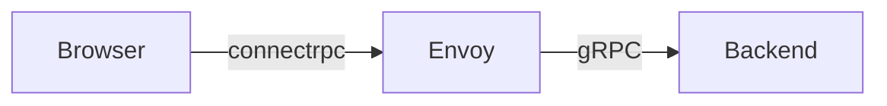

# Fullstack gRPC example

Client uses [connectrpc](https://connectrpc.com) to connect to Envoy proxy which translates it to gRPC and forwards it to the backend. As browsers does not
support gRPC directly. Other option would be to using [grpc-web](https://github.com/grpc/grpc-web), which is a bit more complicated and older.



In the frontend, we use this code to connect to the proxy, ensuring that data is sent in binary (Protocol Buffers) format.
This approach eliminates the need for Envoy to access proto files to convert JSON into Protocol Buffers for the gRPC service
```javascript
import {createConnectTransport} from "@connectrpc/connect-web";

const transport = createConnectTransport({
  baseUrl: 'http://localhost:8080',
  useBinaryFormat: true,
});
```
(For `grpc-web` use `createGrpcWebTransport`.)

Proxy is then configured with this [envoy.yaml](backend/envoy.yaml) and forwards requests to backend. 
